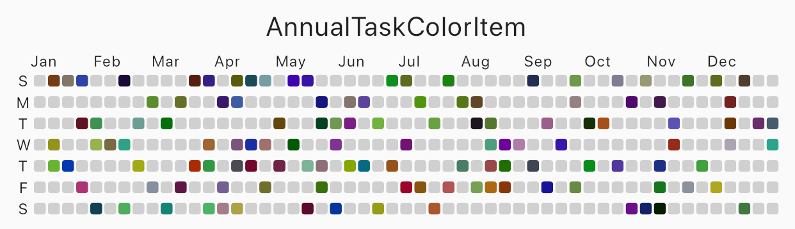

# flutter_annual_task

## flutter_annual_task
Flutter package for displaying grid view of daily task like **Github Distribution**.

**Example**


## Usage

Make sure to check out [example project](https://github.com/HuanSuh/flutter_annual_task/tree/master/example).

```dart
AnnualTaskView(
  taskItem	// List<AnnualTaskItem>
),
```

- - -
### Installation
Add to pubspec.yaml:
```xml
dependencies:
  flutter_annual_task: <version>
```
Then import it to your project:
```dart
import 'package:flutter_annual_task/flutter_annual_task.dart';
```
And finally add `AnnualTaskView` widget in your project.
```dart
AnnualTaskView(
  taskItem	// List<AnnualTaskItem>
),
```
- - -

### AnnualTaskItem
**AnnualTaskItem**

```dart
class AnnualTaskItem {
  final DateTime date;
  final double proceeding;	// 0.0 ~ 1.0

  AnnualTaskItem(this.date, [this.proceeding = 1.0]);
  ...
}
```
The value of `proceeding` affects the opacity on the each cell of daily task.<br/>- For showing the color in visual, the minimum value of displaying is 80(max: 255).
</br>

**AnnualTaskColorItem**

If you want to specify color for each daily task, you can use `AnnualTaskColorItem`.
```dart
class AnnualTaskColorItem extends AnnualTaskItem {
  final Color color;

  AnnualTaskColorItem(
    DateTime date, {
    double proceeding = 1.0,
    this.color,
  }) : super(date, proceeding);
  ...
}
```

You should generate **list of AnnualTaskItem**(`List<AnnualTaskItem>`) to use this package.</br>Below is an example for building  **list of AnnualTaskItem**.
```dart
//AnnualTaskItem
<user_item_list>.map(
  (item) => AnnualTaskItem(
    item.date,
    0.5,
  ),
)
.toList();

//AnnualTaskColorItem
<user_item_list>.map(
  (item) => AnnualTaskColorItem(
    item.date,
    color: <color_for_each_item>
  ),
)
.toList();
```
## Examples
### Cell Shape
Specify cellShape with `AnnualTaskCellShape` with `AnnualTaskCellShape.ROUNDED_SQUARE`(default), `AnnualTaskCellShape.SQUARE` or `AnnualTaskCellShape.CIRCLE`.

**Square**

|  |
| :---: |
| square |
```dart
AnnualTaskView(
  taskItem, // List<AnnualTaskItem>
  cellShape: AnnualTaskCellShape.SQUARE,
)
```
**Circle**

|  |
| :---: |
| circle |

```dart
AnnualTaskView(
  taskItem, // List<AnnualTaskItem>
  cellShape: AnnualTaskCellShape.CIRCLE,
)
```

**AnnualTaskColorItem**

|  |
| :---: |
| circle |

```dart
AnnualTaskView(
  taskItemWithColor, // List<AnnualTaskColorItem>
)
```

### Labels
You can edit the **labels of week** or the **labels of month**.
```dart
AnnualTaskView(
  taskItem, // List<AnnualTaskItem>
  showMonthLabel: false, //default : true
  showWeekDayLabel: false, //default : true
)
```

|  |
| :---: |
| without labels |

**Custom label**

|  |
| :---: |
| custom labels |
```dart
AnnualTaskView(
  taskItem, // List<AnnualTaskItem>
  weekDayLabels: ['', 'Mon', '', 'Wed', '', 'Fri', ''],
  monthLabels: ['1','2','3','4','5','6','7','8','9','10','11','12'],
)
```
The type of `weekDayLabels` and `monthLabels` is `List<String>`.

- `weekDayLabels` starts from Sunday.
- default value of `weekDayLabels' is ['S', 'M', 'T', 'W', 'T', 'F', 'S'].
- default value of `monthLabels' is `['Jan', 'Feb', 'Mar', 'Apr', 'May', 'Jun', 'Jul', 'Aug', 'Sep', 'Oct', 'Nov', 'Dec']`.
- You can also hide the label of each items with empty String(`''`). But, `weekDayLabels` should be **length of 7** and, `monthLabels` should be **length of 12**.

**Styled label**

|  |
| :---: |
| Styled label |
```dart
AnnualTaskView(
  taskItem, // List<AnnualTaskItem>
  labelStyle: TextStyle(
    color: Colors.blueGrey,
    fontSize: 10,
    fontWeight: FontWeight.bold,
  ),	// default label style : TextStyle(fontSize: 8)
)
```
## Props

| props | type | desc |
| :--- | :--- | :--------------- |
| items | `List<AnnualTaskItem>` | List of `AnnualTaskItem` |
| year | `int` | default : `DateTime.now().year` |
| activateColor | `Color` | default : `Theme.of(context).primaryColor` |
| emptyColor | `Color` | Color of cell with proceeding `0.0` or the day which `items` doesn't contain. <br/>default : `Color(0xFFD0D0D0)` |
| showWeekDayLabel | `bool` | Show the labels of week, if true.<br/>default : `true` |
| cellShape | `AnnualTaskCellShape` | Shape of cell. One of `AnnualTaskCellShape.ROUNDED_SQUARE`, `AnnualTaskCellShape.SQUARE` or `AnnualTaskCellShape.CIRCLE`.<br/>default: `AnnualTaskCellShape.ROUNDED_SQUARE` |
| showMonthLabel | `bool` | Show the labels of month, if true.<br/>default : `true` |
| monthLabels | `List<String>` | Labels of month.<br/>default: `['Jan', 'Feb', 'Mar', 'Apr', 'May', 'Jun', 'Jul', 'Aug', 'Sep', 'Oct', 'Nov', 'Dec']` |
| weekDayLabels | `List<String>` | Labels of week.<br/>default: `['S', 'M', 'T', 'W', 'T', 'F', 'S']` |
| labelStyle | `TextStyle` | `TextStyle` of labels.<br/>default: `TextStyle(fontSize: 8)` |
